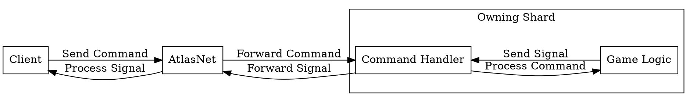
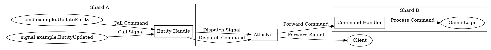
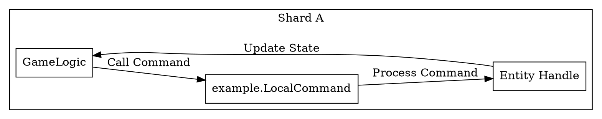

<!-- @page entity_commands_system AtlasNet Entity Commands -->

@tableofcontents

# AtlasNet Entity Commands

## overview Overview

AtlasNet entity commands system. This page describes the command-based
architecture for managing entities in the AtlasNet ecosystem. It covers:
- Command definitions
- Command processing flow
- Examples of common commands
This system allows for flexible and extensible management of entities across
different shards and components in AtlasNet.  
Commands can be sent by Clients or other shards to perform operations on entities. 
The definition of commands is up to the implementation of the shard.  

### Client To Shard logic

an example of a simple command requesting an entity to move to a new position:

### Shard to Shard logic

In a shard-to-shard command scenario, one shard may need to request an operation on an entity that is owned by another shard. For example, if Shard A needs to update the state of an entity owned by Shard B, it can send a command to Shard B through AtlasNet.

In the event that the entity in question is in the same shard that dispatches the command, the command can be processed directly without needing to go through AtlasNet. This allows for efficient handling of commands that do not require cross-shard communication.

