@tableofcontents

# Comunication Overview

## Overview

AtlasNet is designed as a distributed control and data layer where all runtime behavior flows through a strict communication structure. This structure is not just an implementation detail—it is the core contract that ensures determinism, scalability, and clear ownership of state across shards, worlds, and clients.

Because AtlasNet separates simulation authority, state propagation, and peer interaction, all systems built on top of it must adhere to a defined set of communication channels. These channels ensure that every piece of data has a clear origin, direction, and responsibility boundary.

The communication models are as follows:
- Messages
- RPC
- Events
- Commands
- Signals
- Telecom

### Messages

Messages are the fundamental unit of communication in AtlasNet. They are structured data packets that can be sent between clients, shards, and other AtlasNet components. Messages can carry commands, signals, or any other type of information necessary for the simulation.

They are the bare-bones transport mechanism, and all higher-level communication constructs (like commands and signals) are built on top of this messaging layer. It is best used for low-level communication, batching, and custom extensions where the standard command and signal structures do not suffice.
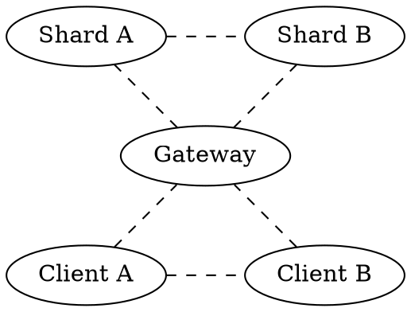
### RPC

RPC (Remote Procedure Call) is a communication pattern that allows any component to invoke methods on remote servers as if they were local. In AtlasNet, RPCs are used for synchronous operations where a client needs to request data or trigger an action on the server and wait for a response.

The RPC system is built on top of the messaging layer, providing a higher-level abstraction for request-response interactions. It is particularly useful for operations that require immediate feedback or confirmation, such as authentication, data retrieval, or configuration changes.

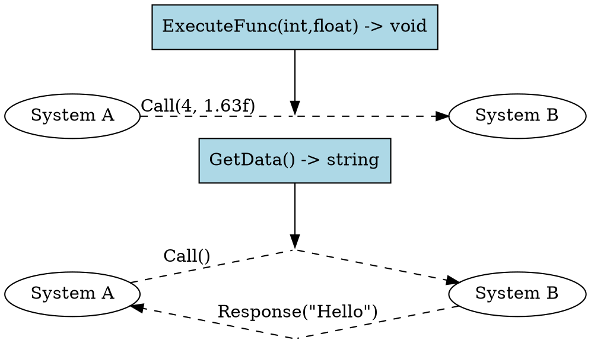
### Commands and Signals

#### Commands

Commands represent authoritative intent directed toward a specific entity within the simulation.

Unlike traditional client-server RPC systems, AtlasNet commands are entity-centric rather than shard-centric. Every command specifies a target entity recipient. AtlasNet automatically resolves the entity's current owner shard and routes the command to the appropriate simulation instance.

This routing remains valid even if entities migrate between shards, worlds, or nodes, as AtlasNet continuously maintains entity ownership information.

Clients can only send commands for the AtlasNet entity that they own. A client cannot directly issue commands for arbitrary entities within the simulation. This ownership restriction ensures clear authority boundaries and prevents clients from mutating state belonging to other players or systems.

Commands are atomic and deterministic. They are processed in a strict order by the authoritative simulation logic, ensuring that the same command sequence always produces the same outcome. This determinism is critical for maintaining consistency across distributed simulations. Entity migration is locked while commands are being processed, preventing race conditions and ensuring that commands are always applied to the correct entity state.

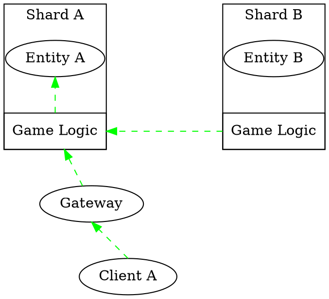
##### Properties
- Entity-centric routing
- Represents intent, not results
- Always authoritative on the server side
- Atomic and deterministic
- Can be sent by clients or shards

##### Examples
- MoveNPC
- SpawnObject
- DealPlayerDamage
- UseAbility
- EnterVehicle
- InteractWithObject
#### Signals
Signals represent authoritative information delivered to a specific client.

Unlike Commands, which target entities, Signals are client-centric. Every signal specifies a client recipient and is routed through the AtlasNet relay network to reach the intended destination.

Signals are generated by authoritative simulation logic and communicate the outcome of simulation events, state changes, notifications, and updates relevant to a particular client.

The sender does not need to know where a client is physically connected. AtlasNet resolves the client's current gateway and relay path automatically.
##### Properties
- Client-centric routing
- Automatically routed through AtlasNet
- Read-Only replication of state changes
- Generated exclusively by shards
- Can be scoped per client or filtered broadcast
- Used for state sync
##### Examples
- NPCMoved
- DamageApplied
- PlayerDied
- FriendConnected
- InventoryUpdated
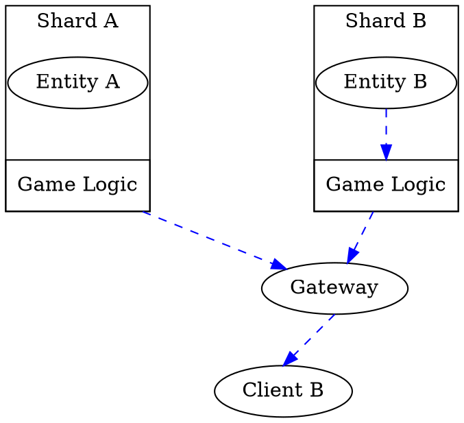
#### Delivery Guarantees
Commands and signals have multiple delivery guarantees that can be configured based on the use case:
- **NoDelay**: Send immediately or drop. No retries or acknowledgements. 
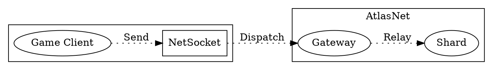
- **Unreliable**: Best effort delivery but no retries. Suitable for high-frequency updates where occasional loss is acceptable.
- **UnreliableBatched**: Same as **Unreliable** but allows for batching multiple commands together to optimize network usage. Batches are sent at regular intervals or when a certain threshold is reached.
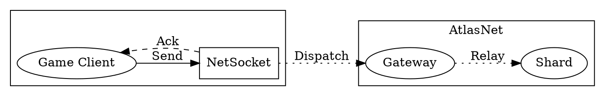
- **GatewayAck**: The gateway confirms receipt of the message, but there are no end-to-end delivery guarantees. Useful for critical commands where the client needs confirmation that the server received it, but the server does not need to guarantee processing. 
This one almost completely guarantees delivery but an internal error or route change could cause it to be dropped. 
- **GatewayAckBatched**: Same as **GatewayAck** but allows for batching commands together at each step of the relay process.
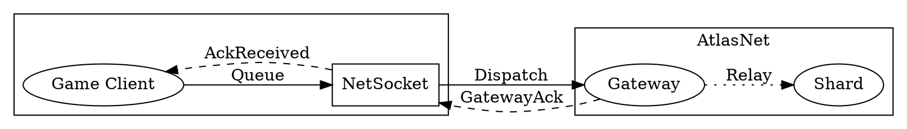
- **ServerAck**: The server confirms that the command was processed and applied to the authoritative state. This is the strongest guarantee and is used for critical game actions that must be reliably executed.
- **ServerAckBatched**: Same as **ServerAck** but allows for batching server acknowledgements together. This is the slowest delivery method since batching will occur at each step of the relay.
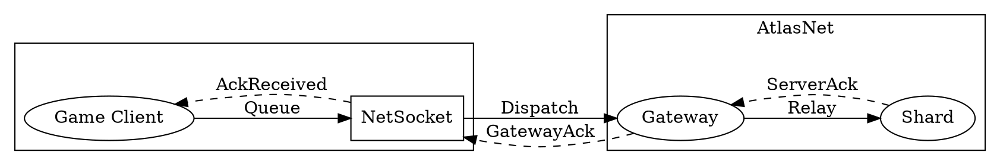

### Telecom
Telecom represents non-authoritative interaction between clients, optionally mediated by AtlasNet infrastructure.

It is not part of the simulation authority chain. Instead, it provides a flexible communication layer for coordination, social systems, and real-time interaction.

Telecom supports multiple transport models:
- **P2P**: direct client-to-client communication (low latency, small groups)
- **Relay**: server-mediated messaging (scalable, controlled)
- **SFU**: selective forwarding for large groups or high-volume streams

- **Hybrid routing**: dynamic selection based on group size, policy, or world context
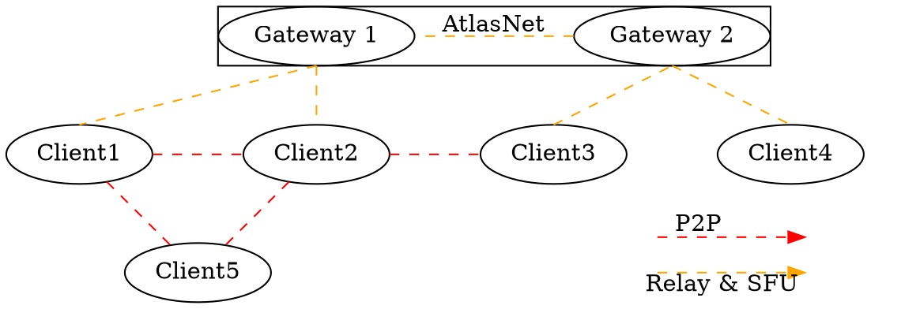

#### P2P
P2P allows clients to communicate directly with each other without routing through the server. This is ideal for low-latency interactions in small groups, such as party chat or direct player interactions. However, it does not scale well for large groups. The number of connections grows quadratically with the number of clients, following the formula:
$$C = \frac{N(N-1)}{2}$$
|  Clients | Connections  |
|---|---|
| 2  | 1  |
| 3  | 3  |
| 4  | 6  |
| 5  | 10  |
| 6  | 15  |
| 7  | 21  |
| 8  | 28  |
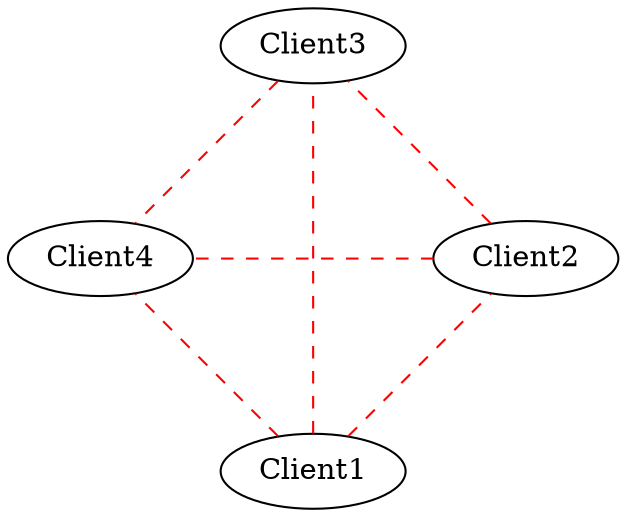
#### Relay & SFU
Relay and SFU prevents the exponential growth of connections between clients in large groups, while still enabling real-time communication and allowing more complex streaming interactions through SFU such as:
- Proximity-based voice chat where only nearby players receive each other's audio
- Selective forwarding of data streams in a large groups
- Server-side moderation, filtering or processing of messages or streams
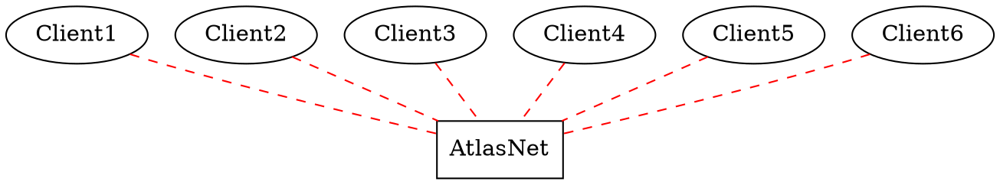
#### Hybrid
Hybrid routing allows for dynamic optimization based on the current context, such as switching to P2P for small groups or low-latency needs, and using relay/SFU for larger groups or when direct connectivity is not possible.

#### Properties
- Does not mutate authoritative state
- May be routed, filtered, or relayed
- Can be scoped per world, region or channel
- Extensive to any real-time stream (chat, voice, gameplay signals, telemetry)
#### Examples:
- Voice chat streams
- Group chat messages
- Party coordination signals
- Live interaction events
