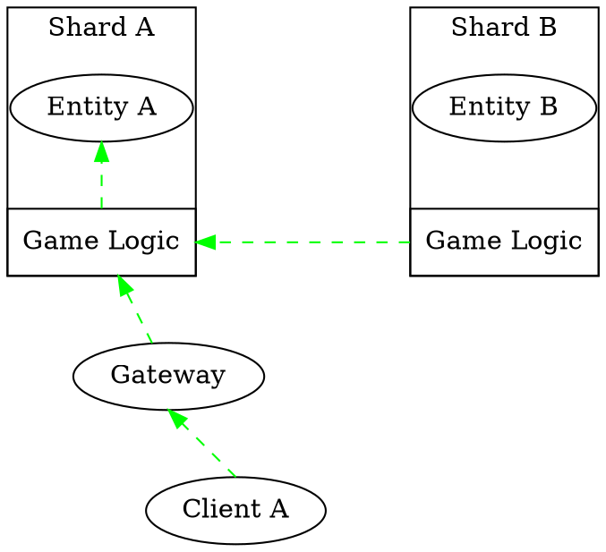
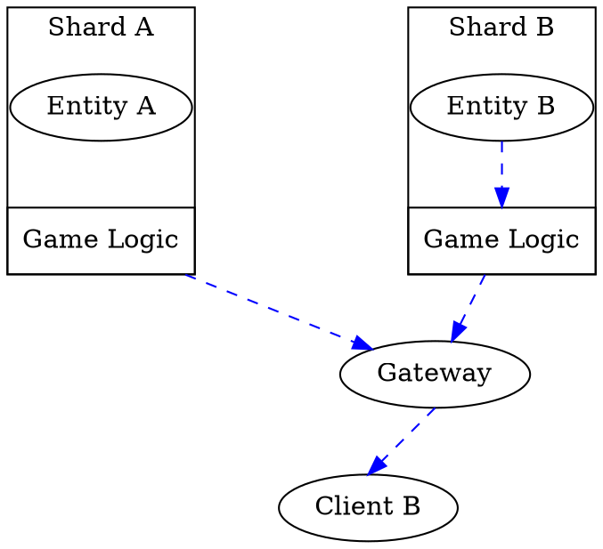
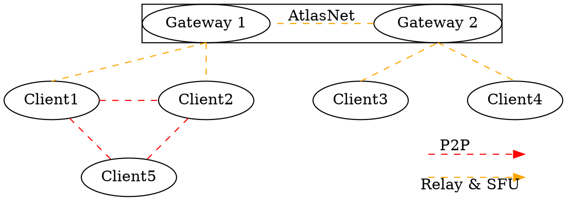

<!-- @page entity_commands_system AtlasNet Entity Commands -->

@tableofcontents

# Comunication Overview

## Overview

AtlasNet is designed as a distributed control and data layer where all runtime behavior flows through a strict communication structure. This structure is not just an implementation detail—it is the core contract that ensures determinism, scalability, and clear ownership of state across shards, worlds, and clients.

Because AtlasNet separates simulation authority, state propagation, and peer interaction, all systems built on top of it must adhere to a defined set of communication channels. These channels ensure that every piece of data has a clear origin, direction, and responsibility boundary.

The communication models are as follows:
- Commands
- Signals
- Telecom

### Commands
Commands represent intent to change the simulation.

Commands represent authoritative intent directed toward a specific entity within the simulation.

Unlike traditional client-server RPC systems, AtlasNet commands are entity-centric rather than shard-centric. Every command specifies a target entity recipient. AtlasNet automatically resolves the entity's current owner shard and routes the command to the appropriate simulation instance.

This routing remains valid even if entities migrate between shards, worlds, or nodes, as AtlasNet continuously maintains entity ownership information.

Clients can only send commands for the AtlasNet entity that they own. A client cannot directly issue commands for arbitrary entities within the simulation. This ownership restriction ensures clear authority boundaries and prevents clients from mutating state belonging to other players or systems.

Commands are atomic and deterministic. They are processed in a strict order by the authoritative simulation logic, ensuring that the same command sequence always produces the same outcome. This determinism is critical for maintaining consistency across distributed simulations. Entity migration is locked while commands are being processed, preventing race conditions and ensuring that commands are always applied to the correct entity state.

##### Properties
- Entity-centric routing
- Represents intent, not results
- Always authoritative on the server side
- Atomic and deterministic
- Can be sent by clients or shards

#### Examples
- MoveNPC
- SpawnObject
- DealPlayerDamage
- UseAbility
- EnterVehicle
- InteractWithObject
### Signals
Signals represent authoritative information delivered to a specific client.

Unlike Commands, which target entities, Signals are client-centric. Every signal specifies a client recipient and is routed through the AtlasNet relay network to reach the intended destination.

Signals are generated by authoritative simulation logic and communicate the outcome of simulation events, state changes, notifications, and updates relevant to a particular client.

The sender does not need to know where a client is physically connected. AtlasNet resolves the client's current gateway and relay path automatically.
#### Properties
- Client-centric routing
- Automatically routed through AtlasNet
- Read-Only replication of state changes
- Generated exclusively by shards
- Can be scoped per client or filtered broadcast
- Used for state sync
#### Examples
- NPCMoved
- DamageApplied
- PlayerDied
- FriendConnected
- InventoryUpdated

### Telecom
Telecom represents non-authoritative interaction between clients, optionally mediated by AtlasNet infrastructure.

It is not part of the simulation authority chain. Instead, it provides a flexible communication layer for coordination, social systems, and real-time interaction.

Telecom supports multiple transport models:
- P2P: direct client-to-client communication (low latency, small groups)
- Relay: server-mediated messaging (scalable, controlled)
- SFU: selective forwarding for large groups or high-volume streams
- Hybrid routing: dynamic selection based on group size, policy, or world context

#### Properties
- Does not mutate authoritative state
- May be routed, filtered, or relayed
- Can be scoped per world, region or channel
- Extensive to any real-time stream (chat, voice, gameplay signals, telemetry)
#### Examples:
- Voice chat streams
- Group chat messages
- Party coordination signals
- Live interaction events
