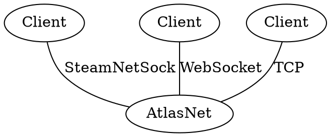

<!-- @page entity_commands_system AtlasNet Entity Commands -->

@tableofcontents

# Networking

## Overview

AtlasNet has multiple internal and ingress communication protocols all with their own purposes and use cases. 
They are divided into two main categories:
- Datagram Transport : connectionless message-oriented protocols
- - UDP
- - DKDP
- Connection Transport : stateful protocols
- - TCP
- - SteamNetSock
- - WebSocket
### Structure

- IConnectionTransport : interface for stateful connections
- IDatagramTransport : interface for connectionless message-oriented protocols
- DatagramConnection : ACK transport protocol that provides reliable message delivery over an unreliable transport protocol (e.g., UDP)

Internally AtlasNet uses datagram transport exclusively for communication between nodes, each node heartbeating to the database rather than to each other.

### Clients
client connection we only support TCP, WebSocket and SteamNetSock for now. All clients must connect to AtlasNet through one of these protocols and any combination of these can be used at the same time. The following diagram shows how clients connect to AtlasNet through different protocols:

