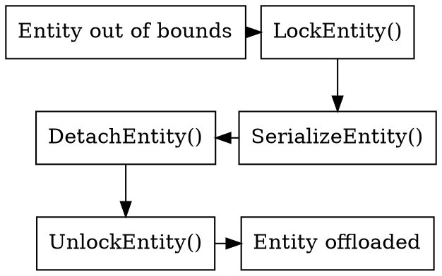
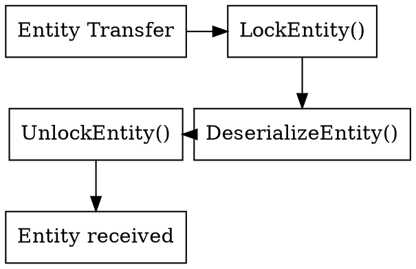

<!-- @page entity_commands_system AtlasNet Entity Commands -->

@tableofcontents
# AtlasNet Shard Interface

## Overview

AtlasNet shard interface definition. This file defines the `IAtlasNetShard` interface, which serves as the base class for all shards in the AtlasNet system.

It provides standardized functions for:

- entity registration
- serialization / deserialization
- locking mechanisms

This ensures all shards can be managed and communicated with consistently across the AtlasNet ecosystem.

## Interface Definition

The primary interface is `AtlasNet::IAtlasNetShard`.

## Actions

### Registering Entities

Shards can register entities with the AtlasNet core using `RegisterEntity`.  
This allows shards to define entity types managed by the system.
### Client Connect

### Entity Offload

#### Releasing

When transferring an entity, the shard must call `DetachEntity`.  
This ensures the entity is no longer owned locally.

#### Receiving

