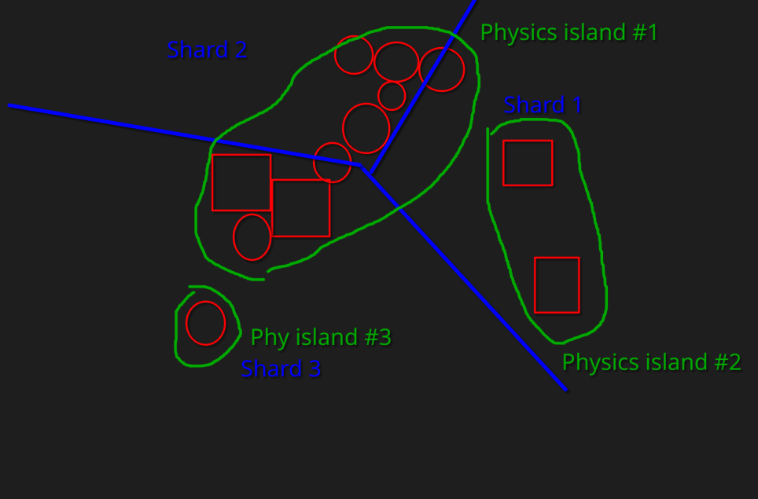
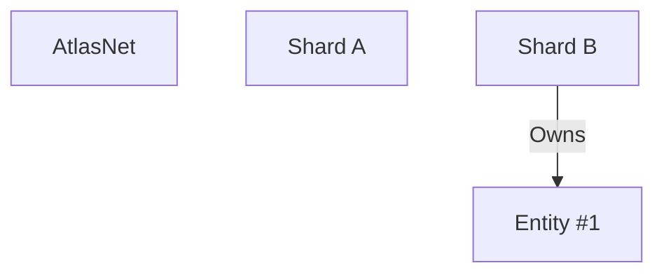
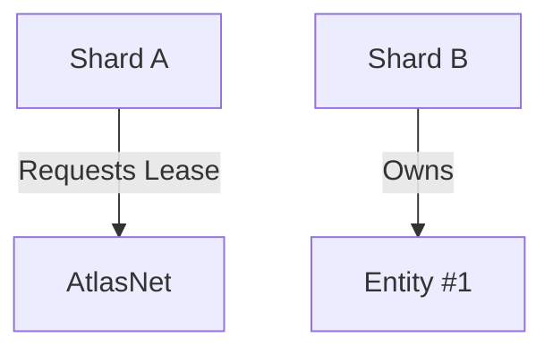
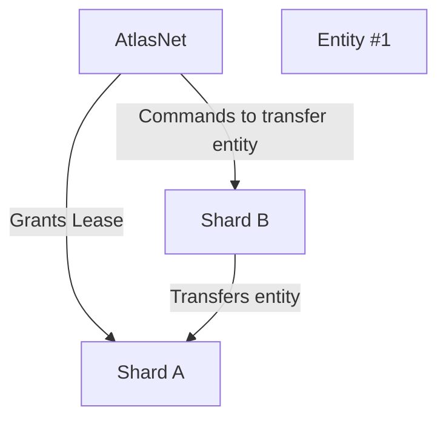
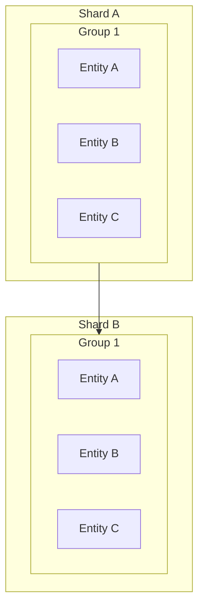
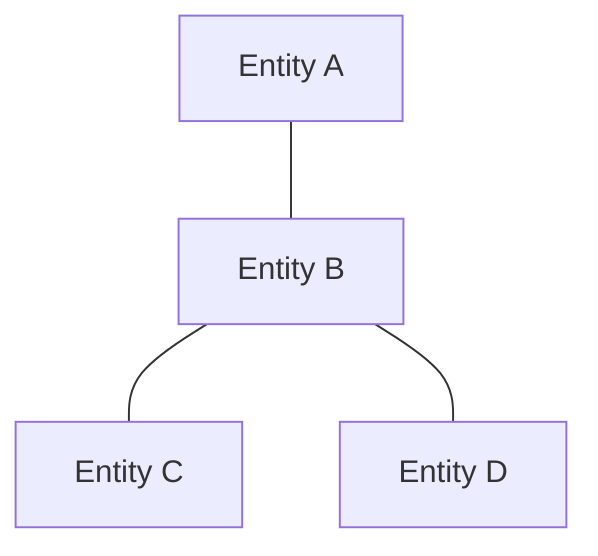

# Overview

The problem we are attempting to solve is the issue in which a shard might have an internal algorithm that requires write permissions of nearby entities even if they are not in the region of the shard itself. 
Examples:
- Physics
  - For example, a physics engine might need to calculate collisions or forces between entities that are near each other but not necessarily within the same shard.
- AI
  - For example, an AI system might need to update the state or behavior of entities that are near each other but not necessarily within the same shard.
- Performance
  - If a game system has numerous entities that need to interact with each other constantly, it can lead to frequent cross-shard interactions and write permissions being required for entities outside the shard's region, potentially causing performance bottlenecks.
# Solution A - Physics Islands
The idea is that entities can have collision shapes assigned to them and these shapes can be used to determine which entities are close enough to interact with each other physically. By grouping entities into "physics islands" based on their collision shapes, the physics engine can limit the scope of its calculations to only those entities within the same island, reducing the need for write permissions on entities outside the island.

# Solution B - Entity Leasing
The idea is that shards can lease entities such that.
1. if the entitiy is within the region of the shard, ownership will be maintained even if the entity moves outside the region.
2. if the entity is outside the region of the shard, the entity will be serialized and transferred to the shard requesting the lease.

This allows more explicit control and versatility to different game systems, enabling them to manage entity ownership and interactions more effectively across shard boundaries.

# Solution C - Groups

entities can be placed into groups manually by the shard API, these groups ensure that all entities within the same group will always be managed together. If entity A,B,C are in a group, even if C moves outside the region of the shard, the shard will continue to manage entity C along with A and B, maintaining group integrity and reducing the need for cross-shard interactions. Groups are transfered when the entire group moves outside the region of the shard, ensuring that group integrity is maintained across shard boundaries.

# Solution D - Links

Much like groups, links allow entities to be associated with each other, thus a group is merely a graph of linked entities. 
This allows for more flexible associations between entities, where entities can be linked without necessarily being in the same group, enabling complex interaction patterns and relationships to be represented and managed efficiently across shard boundaries.

This way groups are far easier to merge or split, as the links between entities can be reconfigured without needing to move entire groups, providing greater flexibility in managing entity associations and interactions across shard boundaries.

